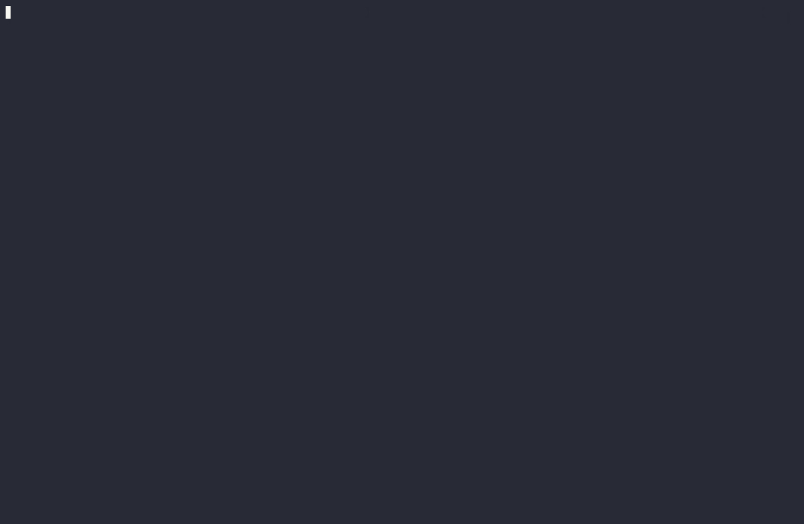
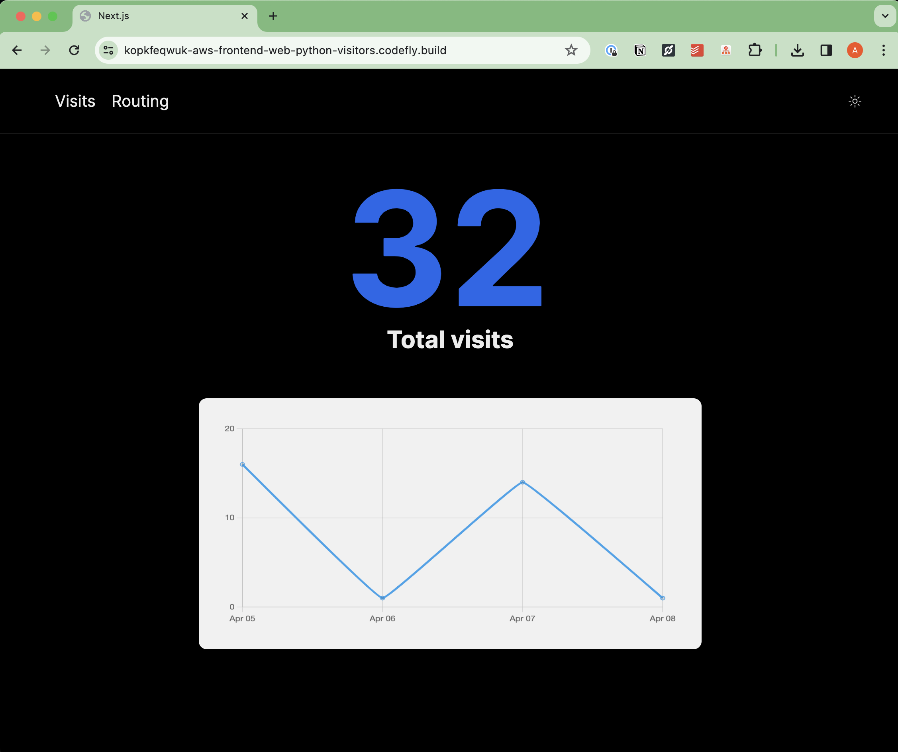
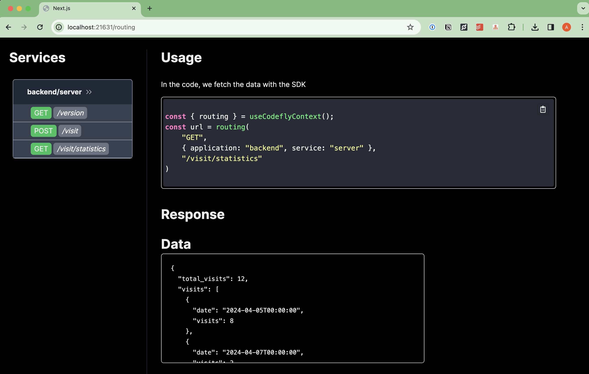
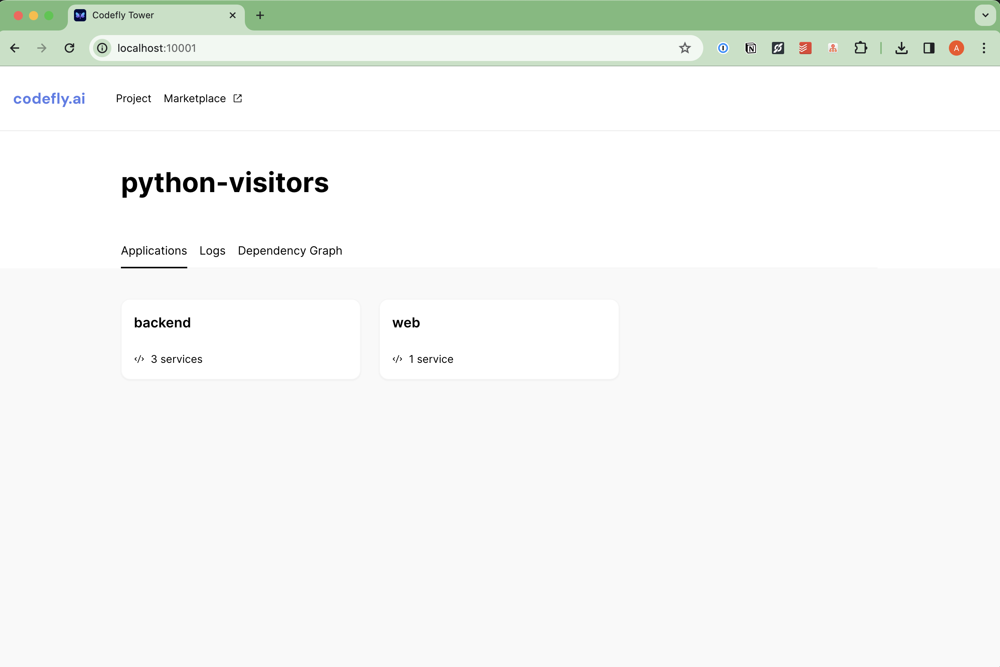
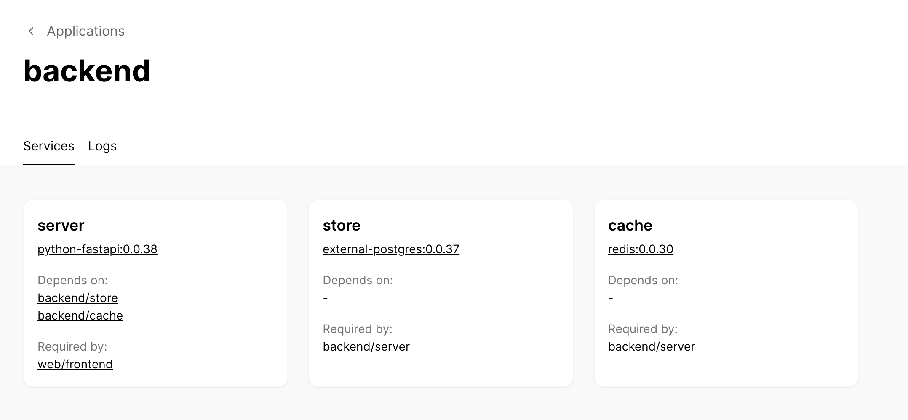
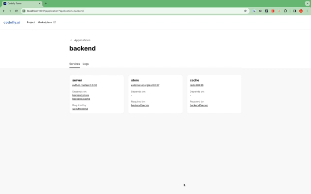

# A simple 3-Tier application: keeping track of a visits on a website

TODO: Diagram

## Introduction

Before we move to how to create such a system, it's important to focus on one aspect of `codefly`: the Developer Experience.

At codefly.ai, we believe that the time to onboard and time to setup should be **ZERO**.

> With `codefly` and Docker installed, you should just pull a Git repository, and type
> `codefly run service`
> on the part of the system you want to run and it will.


## Running things

### Get the code

First, pull the repository with the backend that you want to use

- `python`
```shell
https://github.com/codefly-dev/example-python-visitor.git
```

- `go`
Coming soon

- `Node`
Coming soon

### Running everything

To run any service with `codefly`, you would use `codefly run service` in the service folder you want to run:

```shell
cd applications/web/services/frontend
codefly run service
```

Or you could run

```shell
codefly run service frontend
```
anywhere inside the project folder

> In case you have several services in the project with the same name (service name uniqueness is only required at the application level), you can specify the application as well:
> `codefly run service web/frontend` or run it anywhere inside the `web` application folder.



You should see some amount of logs and let's look at a few lines:

```shell
Running <frontend> with these dependent services: backend/store, backend/cache, backend/server
```

`codefly` recognizes that the `frontend` needs the `backend` to run which in turn requires the `store` and the `cache`.

So `codefly` will run these services for you, in the right order and waiting when it needs to.

So your database is ready when your service needs it.

```shell
backend/server >> will run on http://localhost:42042
```

This will be the local address for your backend `server`.
Ports are automatically generated by `codefly` and are deterministic.
We try to avoid port collision as best as we can: in other words, you can share configuration for your debug tools, `swagger`, `kreya`, DB client configurations, etc...
Everyone gets the same setup!

Your frontend logs that also
```shell
web/frontend   >> will run on http://localhost:21631
```

Click on the url and you get



The website has a nice little nugget: by default, the `Next.js` agent creates a page that show you how in code you access your APIs:



For example, to fetch the data for the statistics, you would use `codefly JavaScript SDK`:

```typescript
const { routing } = useCodeflyContext();
const url = routing(
	"GET",
	{ application: "backend", service: "server" },
	"/visit/statistics"
)
```

### CLI frontend companion

The CLI output is nice but it will quickly get quite busy. So `codefly` comes with its own frontend to help you developing.

Just add the `--server` flag will run a `gRPC/http` server with the CLI.



You can see in a glance the structure of your project. For example, clicking on one application will show you the services running and their dependencies



The companion also provides a convenient way to test your REST endpoints:


